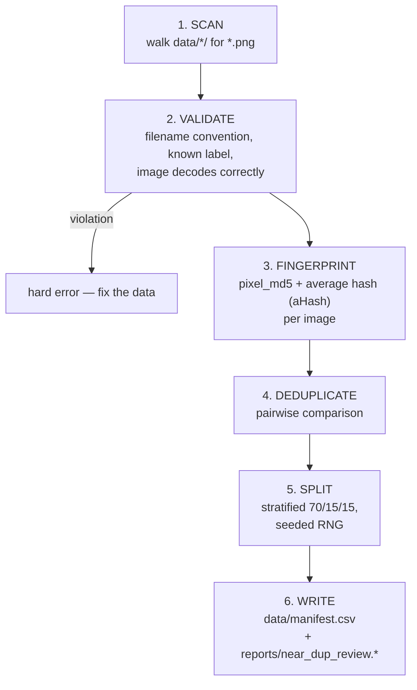

# Data Pipeline

This document describes the design and usage of `src/bunny_classifier/data/`:
how raw labeled images become a reproducible, deduplicated, split dataset
that training can trust.

## Overview

The pipeline solves four problems before any model training starts:

1. **Labeling** — each image's class is encoded in its filename and validated
   against a frozen label set.
2. **Splitting** — images are partitioned into train (70 %) / val (15 %) /
   test (15 %) sets, stratified per class, deterministically.
3. **Deduplication** — exact and near-duplicate images are detected and
   handled so they cannot leak across the train/test boundary and inflate
   evaluation metrics.
4. **Reproducibility** — the resulting assignment is persisted in a
   version-controlled manifest, so any past or future run operates on an
   identical, auditable dataset definition.

## Data layout

```
data/
├── bunnies_batch_260714/     # image batch, named by date (YYMMDD)
│   ├── lying01.png           # <label><number>.png
│   ├── standing83.png
│   └── ...
└── manifest.csv              # the only file under data/ tracked by git
```

Images are kept out of git (`.gitignore`); the manifest is committed because
it is small, textual, and its history documents how the dataset evolved.

### Classes

The label set is frozen in `src/bunny_classifier/labels.py`; index order is
alphabetical and shared by training, export, and serving:

| class | definition |
|---|---|
| `back` | on its back, belly up |
| `cleaning` | grooming itself |
| `lying` | lying down (loaf or sprawled) |
| `moving` | mid-motion: hopping, running |
| `side` | flopped on its side |
| `sitting` | sitting on haunches, front paws down |
| `standing` | upright on hind legs |

Filenames must match `^([a-z]+?)(\d+)\.png$` and the label must be in this
set — anything else fails the build immediately. Failing fast on bad input
is deliberate: silently skipping files would let labeling mistakes go
unnoticed.

## Manifest build

`bunny-data build-manifest` executes the following stages:



The manifest (`data/manifest.csv`) has columns
`path,label,split,batch,phash,added_at` and is **append-only**: re-running
the build never modifies existing rows, it only appends newly discovered
images. Consequently the test set is stable across dataset growth, and
models trained months apart are evaluated against the same held-out images.
A repeated run over unchanged data is a byte-identical no-op.

### Deduplication policy

Two fingerprints are computed per image (`hashing.py`):

- `pixel_md5` — hash of decoded RGB pixels; equality means an exact copy.
- `ahash` — 64-bit average hash: the image is reduced to an 8×8 grayscale
  grid and each cell is thresholded against the mean. Perceptually similar
  images (e.g. two crops of the same photo) differ in only a few bits; the
  bit difference is the Hamming distance.

Pairwise decisions:

| Finding | Action | Rationale |
|---|---|---|
| identical pixels, same label | keep first, mark the rest `split=excluded` | copies add no information |
| identical pixels, **different labels** | exclude both + review report entry | one photo with two labels is a contradiction only a human can resolve |
| distance ≤ 2, same label | exclude the later file | effectively the same photo (minor re-crop) |
| distance 3–5, same label | keep both, **lock into the same split** | possibly two legitimate photos; locking prevents train/test leakage without discarding data |
| distance ≤ 5, **different labels** | keep both + review report entry | cross-class similarity may indicate a labeling error; never auto-resolved |

Cross-label findings are written to `reports/near_dup_review.csv` plus a
contact-sheet PNG for fast visual triage. Same-label near-duplicate groups
are tracked with a union-find structure so an entire group is always
assigned to a single split.

### Split policy

- **Stratified per class** — each class is split independently, with a
  minimum of 2 images in val and in test for any class with ≥ 8 images.
  A global random split could leave a small class (e.g. `moving`, 8 images)
  without any evaluation samples.
- **Deterministic** — the RNG is seeded per class, so identical inputs
  produce identical splits on any machine.
- **Append-aware** — new images fill val/test deficits toward the 15 %
  targets first, then go to train; a new image that is a near-duplicate of
  an already-assigned one inherits that image's split.

## Module reference

| Module | Responsibility |
|---|---|
| `images.py` | `load_rgb()` — decodes any image and flattens alpha over white (pretrained backbones expect 3-channel RGB). Torch-free by design: the production serving image reuses it without pulling in PyTorch. |
| `hashing.py` | `pixel_md5()`, `ahash()`, `hamming()` — the fingerprints described above. |
| `manifest.py` | The pipeline core: `scan_images()` (stages 1–3), `_dedupe()` (4), `_assign_splits()` (5), `build_manifest()` orchestrating and writing the CSV. |
| `dataset.py` | `BunnyDataset` — PyTorch `Dataset` reading exclusively from the manifest; returns `(float32 tensor 3×224×224, class index)`. Also defines `train_transforms()` (RandomResizedCrop, flip, color jitter, rotation) and `eval_transforms()` (resize 256 → center-crop 224 → ImageNet normalization). The eval pipeline is a contract: serving must preprocess identically, and a parity test will enforce this once the serving layer exists. |
| `eda.py` | Writes dataset reports to `reports/eda/`: class/split distribution, image size statistics, per-class sample grids. |
| `review.py` | Renders the cross-label near-duplicate review report (CSV + contact sheet). |
| `importer.py` | `import-batch`: renames a batch delivered as one subfolder per label (raw screenshots) into the flat `<label><number>.png` layout the scanner expects. |
| `cli.py` | The `bunny-data` entry point (registered in `pyproject.toml` `[project.scripts]`). |

## Usage

Ingesting a new photo batch:

```bash
# 1. Drop raw images into a NEW batch folder, one subfolder per label
#    (never modify existing batches):
#    data/bunnies_batch_<YYMMDD>/<label>/<anything>.png

# 2. Flatten + rename into the '<label><number>.png' convention:
uv run bunny-data import-batch data/bunnies_batch_<YYMMDD>   # --dry-run to preview
#    Files land at data/bunnies_batch_<YYMMDD>/<label>NN.png and the
#    (now empty) label subfolders are removed. Numbering restarts at 01 per
#    batch; the batch folder in the manifest path keeps names unique.

# 3. Rebuild the manifest (append-only; existing rows are untouched):
uv run bunny-data build-manifest

# 4. If the output says "REVIEW NEEDED", inspect reports/near_dup_review.png.
#    Correct labels -> no action. Wrong label -> rename the file, go to 3.

# 5. Optional dataset reports:
uv run bunny-data eda
```

Step 2 is only needed when a batch arrives as label subfolders; a batch already
named `<label><number>.png` goes straight to step 3.

`data/manifest.csv` is generated output — never edit it by hand.

Training code (Phase 2+) consumes the dataset via the manifest only:

```python
train_ds = BunnyDataset(manifest, "train", repo_root, transform=train_transforms())
val_ds   = BunnyDataset(manifest, "val",   repo_root)  # defaults to eval_transforms()
```

## Design notes

**Why lock near-duplicates into one split instead of deleting them?**
With ~350 images, every sample matters. Deletion is irreversible; co-locating
a suspect pair in a single split neutralizes the leakage risk at zero data
cost.

**Why is the test set permanent?**
Once a decision is made based on test results, that test set is "spent" —
further tuning against it would constitute indirect training on test data.
A frozen test set keeps every model comparison over the project's lifetime
valid. It should only be replaced if the task itself changes.

**Why filename-encoded labels rather than an annotation file?**
For a single-annotator dataset of this size it is the simplest mechanism
that cannot drift out of sync with the files. The generated manifest
provides the tabular view where one is needed.

**Why a hard error on unknown labels instead of skipping?**
A typo in a filename is a labeling bug. Skipping would shrink the dataset
silently; failing the build surfaces the bug at the cheapest possible
moment.
