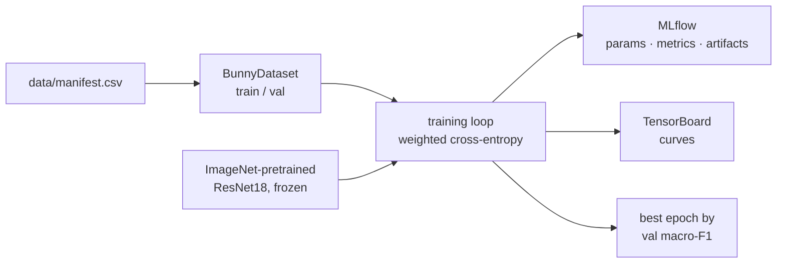

# Training

This document describes `src/bunny_classifier/training/` and
`src/bunny_classifier/models/`: how the manifest-defined dataset becomes a
tracked, reproducible, comparable model run.

## Overview

Phase 2 establishes a **baseline**: the simplest defensible model, tracked
end-to-end, that every later experiment must beat. It deliberately omits
learning-rate schedules, early stopping and backbone fine-tuning — those belong
to Phase 3, where they can be judged against a number that already exists.



## How the model works

The model is a function: it takes an image and returns 7 numbers.

```
image 224×224×3 → [ResNet18 backbone] → 512 numbers → [head] → 7 logits → softmax → 7 probabilities
```

**The image as numbers.** A photo is a grid of pixels, each with three values
(R, G, B). After preprocessing it is a tensor of shape `3 × 224 × 224` — three
channels, 224 rows, 224 columns — rescaled to roughly −2…+2 by the ImageNet
normalization. That tensor is the entire input; the model never sees a file.

**The backbone extracts features.** ResNet18 is 18 layers of convolutions. A
convolution is a small filter (e.g. 3×3) slid across the image looking for a
pattern. Early layers respond to edges and colour gradients, middle layers to
textures (fur, grass, wood), late layers to object parts (an ear, a paw, a body
outline). The stack ends by averaging its final feature map into **512 numbers**
— a description of the image. Two photos of a rabbit lying on its side should
produce similar 512-number descriptions even if the rabbits differ.

**The head is the only part that learns.** `Linear(512, 7)` maps those 512
numbers to 7 — a 7×512 matrix multiplication plus 7 biases, **3 591 parameters**
(`models/backbone.py`).

**Softmax turns scores into probabilities.** The 7 raw outputs (*logits*) can be
any real numbers. Softmax exponentiates and normalizes them so they sum to 1;
the largest is the prediction, and its value is the confidence reported by the
API in Phase 4.

So the model does not learn "what a rabbit looks like". It learns **"given 512
numbers somebody else already computed, which of 7 poses is this"**.

### The path of one image through the code

```
data/manifest.csv                  row: path, label, split
   ↓ BunnyDataset.__getitem__()    data/dataset.py
load_rgb()                         decode PNG, flatten alpha over white → RGB
   ↓ train_transforms()            data/dataset.py
RandomResizedCrop(224) → flip → colour jitter → rotation → normalize
   ↓ DataLoader                    collates 32 images into a batch
tensor 32×3×224×224
   ↓ model(images)                 training/train.py
logits 32×7
```

Note the difference between `train_transforms()` and `eval_transforms()`. The
training version randomly crops, flips, recolours and rotates — **augmentation**.
The model therefore sees a slightly different variant of each photo every epoch,
which is a cheap way to turn 478 images into more effective data and to stop the
model relying on a particular position or lighting.

The eval version is deterministic (resize 256 → centre-crop 224) and is a
**frozen contract** (ROADMAP §5.2). It must be identical in training, export and
production; when it drifts, accuracy drops silently and nothing raises an error.
That is what the Phase 4 parity test exists to prevent.

## Transfer learning, and why the backbone is frozen

The dataset holds ~680 images; a ResNet18 has ~11.2 M parameters. Training all
of them on this much data would memorize the training set rather than learn the
task.

Instead the model starts from ImageNet weights, where the convolutional stack
has already learned generic visual features — edges, textures, fur, body
outlines — from a million photos. `build_model(freeze_backbone=True)` sets
`requires_grad = False` on every pretrained parameter and replaces the 1000-class
ImageNet head with a fresh `Linear(512, 7)`. Only those **3 591 trainable
parameters** are updated; the backbone acts as a fixed feature extractor.

Consequences worth knowing:

- Training is fast even on CPU — the backward pass stops at the head.
- Overfitting is structurally limited: a 7×512 matrix cannot memorize 478 images.
- The ceiling is lower than full fine-tuning. That is the expected trade, and
  exactly what Phase 3 lifts by unfreezing the last block(s).

## Choosing a backbone

`build_model()` takes any name in `SUPPORTED_BACKBONES` and needs no
per-architecture code: `models.get_model()` builds it, and the head is located
by finding the last `nn.Linear` in the module traversal (that is the 1000-class
ImageNet classifier for every torchvision classification model — asserted for
all of them in `tests/test_backbone.py`). Adding a backbone is one entry in the
tuple.

Cost measured locally at 224×224, batch 1, **two CPU threads** to mirror the
e2-micro target. ImageNet top-1 is torchvision's published figure for the
weights `DEFAULT` resolves to.

| backbone | params | fp32 MB | feat dim | CPU ms | top-1 |
|---|---:|---:|---:|---:|---:|
| `mobilenet_v3_small` | 2.5 M | 10 | 1024 | 3 | 67.7 |
| `shufflenet_v2_x1_0` | 2.3 M | 9 | 1024 | 6 | 69.4 |
| `mobilenet_v3_large` | 5.5 M | 22 | 1280 | 6 | 75.3 |
| `efficientnet_b0` | 5.3 M | 21 | 1280 | 11 | 77.7 |
| `regnet_y_800mf` | 6.4 M | 26 | 784 | 14 | 78.8 |
| `resnet18` *(baseline)* | 11.7 M | 47 | 512 | 15 | 69.8 |
| `resnet50` | 25.6 M | 102 | 2048 | 40 | 80.9 |
| `efficientnet_v2_s` | 21.5 M | 86 | 1280 | 37 | 84.2 |
| `convnext_tiny` | 28.6 M | 114 | 768 | 40 | 82.5 |
| `swin_t` | 28.3 M | 113 | 768 | 62 | 81.5 |
| `vit_b_16` | 86.6 M | 346 | 768 | 134 | 81.1 |

**Why top-1 matters more than usual here.** With the backbone frozen we are
training a linear probe on fixed features, so feature quality *is* the ceiling —
a 3 591-parameter head cannot compensate for a weak representation. ImageNet
top-1 is a decent (not perfect) proxy for that quality.

Read the table and `resnet18` looks poor: `mobilenet_v3_large` beats it on
**every** axis — half the parameters, half the size, 2.5× faster, +5.5 top-1.
ResNet18 is a 2015 design kept as the baseline because it is the
well-understood reference point, not because it is the best choice.

The last two rows do not fit the Phase 6 deployment budget (api ≤ 300 MB RAM);
they are available for local experiments only.

**A second axis: better weights for the same architecture.** torchvision ships
`IMAGENET1K_V2` weights for several models — identical architecture and cost,
retrained with a modern recipe:

| model | V1 | V2 | gain |
|---|---:|---:|---:|
| `resnet50` | 76.1 | 80.9 | **+4.7** |
| `regnet_y_800mf` | 76.4 | 78.8 | +2.4 |
| `mobilenet_v3_large` | 74.0 | 75.3 | +1.2 |

`pretrained=True` requests `weights="DEFAULT"`, which already resolves to the
better set, so this needs no action. It is worth internalizing anyway: *how* a
model was trained can matter as much as *what* it is. Note `resnet18` has no V2
weights, which is part of why it sits at 69.8.

### Measured on this dataset — the proxy failed

ImageNet top-1 ranks candidates; it does not predict the winner. Frozen
backbone, val macro-F1:

| backbone | top-1 | lr 1e-3, 15 ep | tuned |
|---|---:|---:|---:|
| `resnet18` | 69.8 | **0.7547** | **0.7755** (40 ep) |
| `convnext_tiny` | 82.5 | 0.7249 | 0.7507 (lr 1e-2, 40 ep) |
| `mobilenet_v3_large` | 75.3 | 0.6991 | — |
| `efficientnet_v2_s` | 84.2 | 0.6603 | 0.6640 (40 ep) · 0.6511 (lr 1e-2) |

The worst performer on this dataset has the *best* ImageNet score, and the
baseline with the *worst* ImageNet score wins.

Part of the gap was an unfair comparison: the defaults were chosen for
ResNet18, and `convnext_tiny` gained +0.026 once given a higher learning rate
and more epochs. This is a general benchmarking trap — **comparing
architectures at hyperparameters tuned for one of them measures the tuning, not
the architecture.** A real sweep must tune per backbone.

But that does not rescue `efficientnet_v2_s`: it sits at 0.65–0.66 across
learning rates and epoch counts, a genuine 0.11 behind ResNet18. Plausible
reasons, none verified here — features from heavily regularized modern recipes
can be more specialized to ImageNet classification and less *linearly
separable* for a new task, and linear-probe quality is known to rank models
differently than fine-tuned quality does.

That last point is the one to carry into Phase 3: **every number above is a
frozen-backbone linear probe.** Unfreezing changes what is being measured, and
the ranking can reorder — a model whose features are not linearly separable
today may still fine-tune best. Do not drop a candidate from the sweep based on
its frozen score alone.

## The training loop

The core of `_train_one_epoch()` is five lines, and they are the whole of
supervised learning:

```python
outputs = model(images)              # 1. predict
loss = criterion(outputs, targets)   # 2. how wrong we are, as one number
loss.backward()                      # 3. compute gradients
optimizer.step()                     # 4. nudge the parameters
optimizer.zero_grad()                # 5. clear gradients for the next batch
```

**Loss** measures wrongness. Cross-entropy penalizes the probability assigned to
the *correct* class: predict 0.9 for the right class and the loss is small,
predict 0.1 and it is large.

**`loss.backward()`** is backpropagation. For every trainable parameter it
computes the *gradient* — "if I increase this parameter slightly, how much does
the loss increase?". It is a derivative, obtained by applying the chain rule
backwards through the network. Frozen parameters have `requires_grad = False`,
so the backward pass stops at the head; this is why freezing is fast.

**`optimizer.step()`** moves each parameter a small step *against* its gradient,
i.e. in the direction that lowers the loss. The step size is the **learning
rate** (0.001 here). Too large and the optimizer overshoots and oscillates; too
small and training crawls. Adam adapts the effective step per parameter, which
is why it is a forgiving default.

**`zero_grad()`** matters because PyTorch *accumulates* gradients: without it,
batch 2 would be updated using batch 1's gradients as well.

### What the learning rate actually does

The gradient supplies a *direction*; the learning rate supplies the *distance*
travelled along it per step. Everything else about training is downstream of
that one number.

Measured on the baseline — 15 epochs, seed 42, only the learning rate changed:

| lr | train loss @1 | train loss @15 | val macro-F1 | reading |
|---|---:|---:|---:|---|
| 1e-5 | 2.09 | 1.96 | 0.1023 | never left the starting point |
| 1e-4 | 2.05 | 1.63 | 0.3881 | learning, far from converged |
| **1e-3** | 1.96 | 0.86 | **0.7547** | the default, and the best here |
| 1e-2 | **3.05** | **0.63** | 0.7271 | overshoots, then fits train hardest — and generalizes worse |
| 1e-1 | **26.16** | 3.20 | 0.7034 | diverges on the first steps, never recovers |

Three signatures worth being able to recognize:

- **Too low.** At 1e-5 the loss falls from 2.09 to 1.96 in fifteen epochs.
  Random guessing over 7 classes costs `ln(7) = 1.946`, so the model is still at
  chance — macro-F1 0.10 confirms it. Nothing is broken; the steps are simply
  too small to arrive anywhere.
- **Too high.** At 1e-1 the epoch-1 training loss is **26.16**, an order of
  magnitude *above* where it started. The first updates threw the head far past
  anything sensible. It partially recovers but keeps oscillating (3.20 train /
  4.07 val at the end) instead of settling.
- **Slightly too high — the subtle one.** At 1e-2 the epoch-1 loss (3.05) also
  starts above the initial 1.95, so it overshot too, yet it ends with the
  *lowest training loss of the whole sweep* (0.63) while scoring worse on val
  than 1e-3. Optimizing the training set harder is not the goal. Judge a
  learning rate on validation, never on training loss.

**Adam changes what the number means.** With plain SGD the step is
`lr × gradient`, so the right `lr` depends on how large the gradients happen to
be. Adam divides by a running estimate of gradient magnitude, so each parameter
moves by roughly `lr` per step regardless of gradient scale. That is why 1e-3 is
a famous default that transfers across problems, and why Adam tolerates being
wrong by a factor of ten — as the table shows, 1e-2 and 1e-1 still land near
0.70 rather than failing outright.

**It is not a universal constant, though.** In the backbone comparison above,
`convnext_tiny` needed 1e-2 (+0.026 over 1e-3) while `resnet18` prefers 1e-3.
The features leaving different backbones have different scales, so the head's
gradients do too. This is the concrete reason a sweep must tune the learning
rate *per backbone* rather than inheriting one architecture's default.

**How to find it.** Sweep log-spaced (1e-5, 1e-4, … as above) rather than
linearly — the useful range spans orders of magnitude. Take the largest value
that still trains stably, which typically sits just below where the epoch-1 loss
starts rising above its initial value. Phase 3 adds schedules (cosine,
one-cycle) that begin high for fast progress and decay for fine settling,
getting both properties from one run.

Two units of scale:

- **Batch** — 32 images processed together. The gradient is averaged over them,
  which is more stable than one image and faster than all of them.
- **Epoch** — one pass over the training set. 478 images / 32 = 15 batches, so
  the 15-epoch baseline performs 225 parameter updates in total. That is few,
  and it shows: the loss curve had not flattened by the last epoch.

After each epoch the model switches to `model.eval()` and the validation split
is scored under `@torch.no_grad()` — no gradients, no updates, just measurement.
(`eval()` also changes the behaviour of dropout and batch-norm layers, which
behave differently during training and inference.)

## Input resolution: why 224×224×3

The `3` is simply the RGB channels. The `224` has three independent
justifications.

**1. It divides cleanly.** ResNet18 halves the spatial size five times — a total
stride of 32 — and 224 = 32 × 7, so the final feature map is exactly 7×7:

```
input 224:  224 → 112 → 56 → 56 → 28 → 14 → 7      (final map 7×7)
input 128:  128 →  64 → 32 → 32 → 16 →  8 → 4      (4×4)
input 384:  384 → 192 → 96 → 96 → 48 → 24 → 12     (12×12)
```

Any multiple of 32 works; 224 is not unique in this respect.

**2. The pretrained weights were trained at that size.** This is the binding
reason. We are not using ResNet18 as an architecture, we are using *specific
learned filters*, and those filters are tuned to a particular scale — a filter
that fires on "fur" learned what fur looks like when the rabbit is ~224 px
across. Change the input size and the same fur is coarser or finer than the
filter expects.

**3. It is not a hard constraint.** The layer before the head is
`AdaptiveAvgPool2d((1,1))`, which averages a feature map of *any* size down to
one number per channel. The model therefore accepts any input above ~32 px
without error. The problem is not shape, it is distribution mismatch.

Measured on the trained baseline (evaluated at different resolutions, val split):

| crop | val macro-F1 |
|---:|---:|
| 96 | 0.4831 |
| 128 | 0.6688 |
| 160 | 0.7519 |
| 192 | 0.7766 |
| **224** | **0.7755** |
| 288 | 0.6962 |
| 384 | 0.6066 |

The curve peaks where the model was trained and falls off **in both
directions**. Note that 384 scores *worse* than 128 despite carrying nine times
the pixels: more information does not help when it breaks the scale the weights
expect.

Two honest caveats about that table:

- It does not show that 224 is the best resolution. It shows the cost of
  *deviating from the training resolution*. Train at 160 and the peak would
  likely sit at 160.
- 192 vs 224 (0.7766 vs 0.7755) is noise. The val split has 102 images, so one
  image is worth roughly 0.01 macro-F1.

**Why not go bigger?** Compute scales with area: 384² is 2.9× the pixels of
224², hence ~2.9× the work and memory in every convolution. Phase 6 deploys to a
1 GB e2-micro with no GPU, where every pixel shows up in response latency.

**Why resize to 256 before cropping 224?** 224/256 = 87.5 %, the standard
ImageNet evaluation protocol. Resizing straight to 224×224 would either distort
the aspect ratio or crop right to the subject's edge; the margin lets the centre
crop keep the whole animal. Again, it also matches how the pretrained weights
were evaluated.

Changing this is legitimate — but the order is: amend ROADMAP §5.2 → retrain at
the new resolution → compare in MLflow → only then update serving. Never just
edit the number in the transforms.

## Handling class imbalance

Class sizes range from 61 (`back`) to 124 (`side`). Rather than discarding
images from the larger classes, the loss is weighted by inverse frequency
(ROADMAP §3):

```
w_c = N / (K · n_c)
```

so each class contributes equally to the total loss regardless of how many
images it has. `nn.CrossEntropyLoss(weight=...)` applies it. Without weighting,
a model can lower its loss by systematically under-predicting the smallest class
— which is precisely the failure macro-F1 is meant to expose.

## Metrics

All metrics derive from one confusion matrix (`training/metrics.py`,
`matrix[true][predicted]`) and are pure Python, so they are unit-tested in CI
where torch is not installed.

| Metric | Meaning | Why it is here |
|---|---|---|
| `val_macro_f1` | unweighted mean of per-class F1 | **Headline.** Every class counts the same, so ignoring a small class is punished. |
| `val_accuracy` | share of correct predictions | Intuitive, but flattering under imbalance — reported, never decided on. |
| `majority_baseline_macro_f1` | macro-F1 of "always predict the largest class" | The floor. A macro-F1 only means something relative to it. |
| per-class precision / recall / F1 | `val_class_report.csv` | Shows *which* class fails, which the headline number hides. |
| confusion matrix | CSV + row-normalized PNG | Shows *what it is confused with* — expected: `lying`↔`side`, `side`↔`back`, `sitting`↔`cleaning`. |

Undefined ratios (a class that is never predicted, an empty split) evaluate to
`0.0` rather than raising — the standard convention, and the reason those cases
have explicit tests.

## The val / test discipline

The loop trains on `train` and selects its best epoch on `val`. **The `test`
split is not touched** unless `--eval-test` is passed explicitly.

The reason is that a test set is spent the moment a decision is made on it. Epoch
selection is such a decision: reporting the best-of-15 epochs measured on test
reports a number tuned on test, which is optimistic and no longer an estimate of
unseen performance. `val` exists to absorb that. Reserve `--eval-test` for a
model actually being shipped.

## Reproducibility

A run is fully determined by **config + manifest + seed**:

- `TrainConfig` (`training/config.py`) is a frozen dataclass holding every knob;
  it is logged as MLflow params *and* written to `config.json` next to the model.
- `set_seeds()` seeds Python and torch RNGs; the train `DataLoader` gets its own
  seeded `Generator`, so batch order is reproducible.
- The manifest pins the exact image-to-split assignment (see [data.md](data.md)).

The config can come from a YAML file (`--config run.yaml`), which overlays the
dataclass defaults; individual CLI flags then overlay the file. An unset flag is
`None` and changes nothing, which is what makes the three layers compose.

## Tracking

**MLflow** stores params, per-epoch metrics and artifacts. The backend is local
SQLite (`mlflow.db`) with artifacts in `mlartifacts/` — *not* the classic
`./mlruns` file store, which MLflow 3 has put into maintenance mode and now
refuses outright; the Phase 3 model registry requires a database backend anyway.
Both paths are gitignored. Set `MLFLOW_TRACKING_URI` to override.

Artifacts logged per run:

| Artifact | Contents |
|---|---|
| `labels.json` | the frozen label list, index = class id (ROADMAP §5.1) — travels with every model |
| `config.json` | the resolved `TrainConfig` |
| `model.pt` | best-epoch `state_dict` + backbone name + labels |
| `val_confusion_matrix.csv` / `.png` | counts, and a row-normalized heatmap |
| `val_class_report.csv` | per-class precision / recall / F1 / support |
| `val_predictions.png` | contact sheet: **errors first**, green border correct, red wrong |

**TensorBoard** receives the loss and metric curves under `runs/<run-name>/`.
Both tools are used on purpose: MLflow compares *runs* (which config won),
TensorBoard inspects *one run over time* (is it still improving, is it
diverging).

The prediction grid shows misclassifications before correct predictions —
a wall of successes carries no information about what to fix next.

## Usage

```bash
uv sync --extra train

uv run bunny-train                          # baseline: resnet18, frozen, 15 epochs
uv run bunny-train --epochs 30 --learning-rate 5e-4
uv run bunny-train --config configs/baseline.yaml
uv run bunny-train --eval-test              # only for a model you intend to ship
```

Useful flags: `--backbone`, `--batch-size`, `--seed`, `--device auto|cpu|cuda`,
`--num-workers`, `--no-class-weighting`, `--run-name`, `--experiment`.

Configuration composes in three layers, each overriding the previous:
**`TrainConfig` defaults → YAML file → CLI flags**. An unset flag is `None` and
changes nothing, which is what lets the layers stack.

Training runs on CPU when no CUDA device is present. With a frozen backbone that
is perfectly workable at this dataset size; a GPU matters for the Phase 3 sweeps.

## Running the tracking UIs

Both are ordinary long-running web servers reading files this repo already
wrote. Start them in **separate terminals** (or with `&`) — they are independent
of training, can be started before, during or after a run, and several runs can
write while they are open.

```bash
# terminal 2
mlflow ui --backend-store-uri sqlite:///mlflow.db     # http://localhost:5000

# terminal 3
tensorboard --logdir runs                             # http://localhost:6006
```

Both read state from disk (`mlflow.db` / `runs/`), so they pick up new runs on
refresh; neither needs restarting between experiments. Stop them with Ctrl-C.
Add `--port N` if something already occupies the default port.

See [tracking.md](tracking.md) for the mechanics: MLflow/TensorBoard concepts,
where every tracking call lives in the code, and recipes for adding a new
parameter, metric or artifact.

They answer different questions:

| Tool | Question | Use it to |
|---|---|---|
| MLflow | *Which configuration won?* | Compare runs side by side, sort by `val_macro_f1`, read params, download artifacts. |
| TensorBoard | *What happened inside one run?* | See whether the loss is still falling, whether val diverges from train (overfitting), where the curve flattens. |

In the MLflow UI: open the experiment, tick several runs, press **Compare** for
a parallel-coordinates plot of params against metrics. Artifacts (confusion
matrix, prediction grid) are on each run's own page.

## Experiment workflow

The point of the tracking setup is that experiments are cheap and comparable.
A disciplined loop:

**1. Change exactly one thing** and give it a name that says what changed:

```bash
uv run bunny-train --run-name baseline                              # reference point
uv run bunny-train --run-name no-weights --no-class-weighting
uv run bunny-train --run-name lr-10x     --learning-rate 0.01
uv run bunny-train --run-name mobilenet  --backbone mobilenet_v3_small
uv run bunny-train --run-name epochs-40  --epochs 40
```

Changing two knobs at once produces a number you cannot attribute. If a run
seems promising, only then combine.

**2. Read three things, in this order:**

- `val_macro_f1` against `majority_baseline_macro_f1` — did it move at all?
- `val_class_report.csv` — *which* class moved? A change that lifts the headline
  by helping one class while wrecking another is usually not the change you want.
- `val_predictions.png` — look at the actual failures. Frequently the answer is
  "these two photos are genuinely ambiguous" or "this label is wrong", not a
  modelling problem.

**3. Check the curves in TensorBoard** before concluding. Common readings:

| Pattern | Meaning | Response |
|---|---|---|
| train and val loss both still falling at the last epoch | undertrained | more epochs |
| train loss falls, val loss rises | overfitting | more augmentation, weight decay, fewer trainable params, stop earlier |
| loss jumps around without settling | learning rate too high | lower it |
| loss barely moves | learning rate too low, or nothing is trainable | raise it; check `trainable_params` in the run's params |

**4. Judge the size of the difference.** With 102 validation images one image is
worth ~0.01 macro-F1, so a 0.005 difference between two runs is noise, not a
result. To tell a real effect from seed luck, re-run the promising config with
two or three different `--seed` values and compare the spread against the gap
you are claiming.

**5. Keep the test split closed.** Every step above happens on val. Only when a
model is genuinely going to be deployed does `--eval-test` get used, once.

Worked example from this phase: the baseline's loss was still falling at epoch
15, so a single run with `--epochs 40` (nothing else changed) was logged. It
scored 0.7755 against 0.7547 — three times the training for +0.021. That is the
frozen backbone approaching its ceiling, and it is the concrete argument for
unfreezing in Phase 3 rather than simply training the baseline for longer.

## Module reference

| Module | Responsibility |
|---|---|
| `models/backbone.py` | `build_model()` — pretrained backbone + fresh head, optional freezing; `parameter_counts()`. |
| `training/config.py` | `TrainConfig` dataclass, YAML loading, CLI overlay, MLflow param export. Torch-free. |
| `training/metrics.py` | Confusion matrix, per-class precision/recall/F1, macro-F1, majority baseline. Pure Python. |
| `training/artifacts.py` | `labels.json`, confusion-matrix CSV/PNG, class report, prediction grid. PIL-only, like `data/eda.py`. |
| `training/train.py` | The loop: loaders, weighted loss, epochs, best-epoch tracking, MLflow + TensorBoard, artifact writing. |
| `training/cli.py` | The `bunny-train` entry point. |

## Design notes

**Why PIL instead of matplotlib for the plots?**
Pillow is already a base dependency (the data pipeline needs it); matplotlib
would be a new one, pulled into every training environment, to draw two figures
that are essentially grids of rectangles and text.

**Why is the best epoch kept in memory rather than checkpointed each epoch?**
The model is 45 MB and runs are minutes long. Writing every improvement to disk
would buy nothing but I/O; the best `state_dict` is cloned to CPU memory and
saved once at the end.

**Why no early stopping?**
It is a Phase 3 concern. Fifteen epochs on a frozen backbone is cheap, and the
full curve is more informative than a truncated one while the pipeline is still
being characterized.
